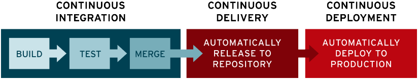
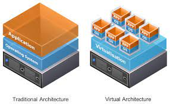

# Introduction: 

## What is DevOps? 

DevOps is a set of practices, tools, and a cultural philosophy that automate and integrate the processes between software development and IT teams.

Development and operations form the crux of DevOps. These two units form a tight-knit collaborative bond, and any software-related processes are equally designed around both teams. Additionally, effective implementation of DevOps is dependent on establishing an efficient pipeline. This cyclical collection of stages covers everything from planning to release and the capabilities needed within the delivery process:

## SDLCs (Software Development Life Cycles)

1. Water Fall Model: This model requires to complete previous stages of models to move on to next one. Very Rigid and applicable for small projects.
2. Agile Model: This is itrative model where the stages are re-visited again in order to update/add new ideas for the project. (4-6 Weeks for each itration).
In this model, the Operations, Development and Q/A departments. From developmet -> testing -> deployement it takes a lot time and efforts. Hence, not ideal SDLC for large scale projects.
3. Spiral Model: The Spiral Model is a software development life cycle (SDLC) model that provides a systematic and iterative approach to software development. It is based on the idea of  spiral, with each iteration of the spiral representing a complete software development cycle, from requirements gathering and analysis to design, implementation, testing, and maintance.
-- Planning: The first phase of the Spiral Model is the planning phase, where the scope of the project is determined and a plan is created for the next iteration of the spiral.
-- Risk Analysis: In the risk analysis phase, the risks associated with the project are identified and evaluated.
-- Engineering: In the engineering phase, the software is developed based on the requirements gathered in the previous iteration.
-- Evaluation: In the evaluation phase, the software is evaluated to determine if it meets the customer’s requirements and if it is of high quality.
-- Planning: The next iteration of the spiral begins with a new planning phase, based on the results of the evaluation.

## DevOps LifeCycle

1. Code.
2. Code Build.
3. Code Test and code analysis.
4. Delivery.
5. DB/Sec Changes.
6. Software Testing.
7. Deploy to Product. 
8. Going Live.

# CI/CD: 

The acronym CI/CD has a few different meanings. The "CI" in CI/CD always refers to continuous integration, which is an automation process for developers. Successful CI means new code changes to an app are regularly built, tested, and merged to a shared repository. It’s a solution to the problem of having too many branches of an app in development at once that might conflict with each other.

The "CD" in CI/CD refers to continuous delivery and/or continuous deployment, which are related concepts that sometimes get used interchangeably. Both are about automating further stages of the pipeline, but they’re sometimes used separately to illustrate just how much automation is happening.

Continuous delivery usually means a developer’s changes to an application are automatically bug tested and uploaded to a repository (like GitHub or a container registry), where they can then be deployed to a live production environment by the operations team. It’s an answer to the problem of poor visibility and communication between dev and business teams. To that end, the purpose of continuous delivery is to ensure that it takes minimal effort to deploy new code.

Continuous deployment (the other possible "CD") can refer to automatically releasing a developer’s changes from the repository to production, where it is usable by customers. It addresses the problem of overloading operations teams with manual processes that slow down app delivery. It builds on the benefits of continuous delivery by automating the next stage in the pipeline.

# Virtualisation: 

Virtualization creates a simulated, or virtual, computing environment as opposed to a physical environment. Virtualization often includes computer-generated versions of hardware, operating systems, storage devices, and more. This allows organizations to partition a single physical computer or server into several virtual machines. Each virtual machine can then interact independently and run different operating systems or applications while sharing the resources of a single host machine.

Hypervisors: A hypervisor, also known as a virtual machine monitor or VMM, is software that creates and runs virtual machines (VMs). A hypervisor allows one host computer to support multiple guest VMs by virtually sharing its resources, such as memory and processing.

## Types of hypervisors:
    -- Type 1 (Bare Metal) : They run on directly top of a physical server and on to the base OS. It is only for Productions. Eg: VMWare esxi, Xen Hypervisor
    -- Type 2 (Hosted Hypervisors): Type 2 hypervisors run inside the physical host machine's operating system, which is why they are called hosted hypervisors. he system with a hosted hypervisor contains:

        A physical machine.
        An operating system installed on the hardware (Windows, Linux, macOS).
        A type 2 hypervisor software within that operating system.
        Guest virtual machine instances.
    
    Note: Type 1 hypervisors can be stacked together for other VM's.