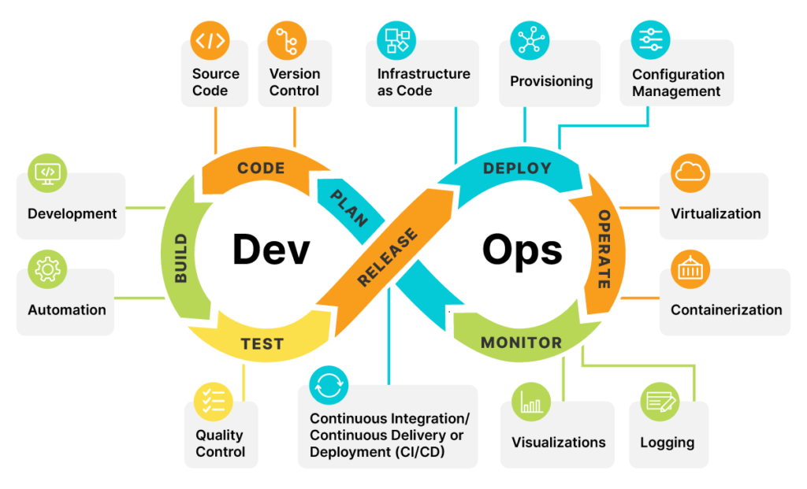
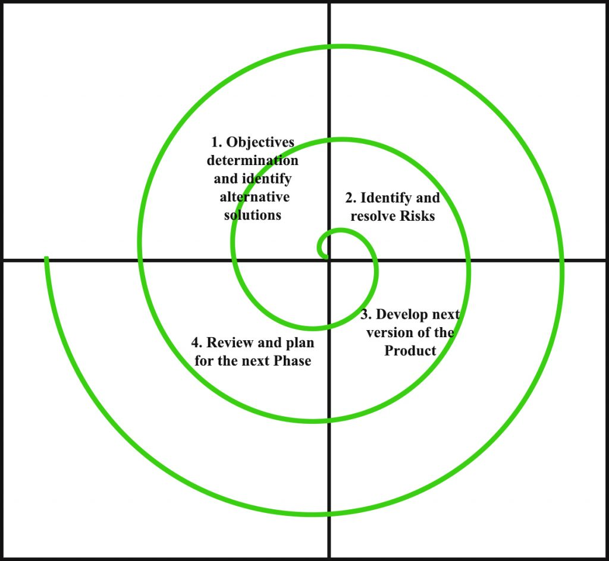

# Introduction: 

## What is DevOps? 

DevOps is a set of practices, tools, and a cultural philosophy that automate and integrate the processes between software development and IT teams.

Development and operations form the crux of DevOps. These two units form a tight-knit collaborative bond, and any software-related processes are equally designed around both teams. Additionally, effective implementation of DevOps is dependent on establishing an efficient pipeline. This cyclical collection of stages covers everything from planning to release and the capabilities needed within the delivery process:

## SDLCs (Software Development Life Cycles):

1. Water Fall Model: This model requires to complete previous stages of models to move on to next one. Very Rigid and applicable for small projects.
2. Agile Model: This is itrative model where the stages are re-visited again in order to update/add new ideas for the project. (4-6 Weeks for each itration).
In this model, the Operations, Development and Q/A departments. From developmet -> testing -> deployement it takes a lot time and efforts. Hence, not ideal SDLC for large scale projects.
3. Spiral Model: The Spiral Model is a software development life cycle (SDLC) model that provides a systematic and iterative approach to software development. It is based on the idea of  spiral, with each iteration of the spiral representing a complete software development cycle, from requirements gathering and analysis to design, implementation, testing, and maintance.
-- Planning: The first phase of the Spiral Model is the planning phase, where the scope of the project is determined and a plan is created for the next iteration of the spiral.
-- Risk Analysis: In the risk analysis phase, the risks associated with the project are identified and evaluated.
-- Engineering: In the engineering phase, the software is developed based on the requirements gathered in the previous iteration.
-- Evaluation: In the evaluation phase, the software is evaluated to determine if it meets the customer’s requirements and if it is of high quality.
-- Planning: The next iteration of the spiral begins with a new planning phase, based on the results of the evaluation.

## DevOps LifeCycle

1. Code.
2. Code Build.
3. Code Test and code analysis.
4. Delivery.
5. DB/Sec Changes.
6. Software Testing.
7. Deploy to Product. 
8. Going Live.

#