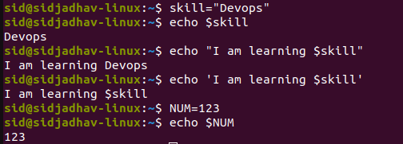

# JSON, YAML, Linux servers

### variables in bash: 

### JSON 
JSON (JavaScript Object Notation) is a lightweight data-interchange format. It is easy for humans to read and write. It is easy for machines to parse and generate. It is based on a subset of the JavaScript Programming Language Standard.
JSON is an key-value document.

eg: <{
    "skills":"DevOps",
    
    "Year":2023,
    "Tech":{
          "Cloud": "AWS",
          "Containers":"K8s",
          "CICD": "Jenkins",
          "GitOps":[
              "Gitlab",
              "ArgoCD",
              "Tekton"
        ]
    }
}>