# LINUX COMMANDS AND OPERATIONS
 
1. Basics CLI Commands.
2. Understanding files in Linux.
3. Filters and Redirection
4. Users and Group.
5. Sudo 
6. Software management.
7. Services and Processes.
8. Advanced commands.
9. Server Managements.

## Linux Directories

The file Structure of linux with the extensions is:

## Commands and File Systems

1. The following commands checks for the current directory, os release etc.

2. sudo -i command will switch us to root directory.

3. This is top level directory for UNIX OS

Note: /bin is absolute path.

4. Linux Command Syntax
    -- [command] [options] [arguments]
    eg: cp -r filetobecopied destinationPath

    Note: [command] --help to get to more about an command.

5. Most Used Linux commands to be used: https://www.javatpoint.com linux-commandsJavaPoint

6. Note: Be very careful while using [rm -rf *] command, as it deletes all present directories in the current workig directories and it do not have any backup.

## VIM EDITOR

Vim is a Unix text editor that's included in Linux, BSD, and macOS. It's known for being fast and efficient, in part because it's a small application that can run in a terminal (although it also has a graphical interface), but mostly because it can be controlled entirely with the keyboard with no need for menus or a mouse.

VIM has 3 modes:
    -- Command Mode.
    -- Insert Mode. (edit mode).
    -- extended command Mode.

## Types of Files in Linux 

In Linux, everything is considered as a file. In UNIX, seven standard file types are regular, directory, symbolic link, FIFO special, block special, character special, and socket. In Linux/UNIX, we have to deal with different file types to manage them efficiently.

In Linux/UNIX, Files are mainly categorized into 3 parts:
    -- Regular Files
    -- Directory Files
    -- Special Files

    Note: ls -l command gives long listing of existing files in current dict.

-- Making entire Directorty Structure : [mkdir -p [directory absolute path]].

### Soft Link in file systems

If we change the path of file, the link becomes dead.

To remove the link:

## Filter & I/O redirections commands

### grep command: 

The grep filter searches a file for a particular pattern of characters, and displays all lines that contain that pattern. The pattern that is searched in the file is referred to as the regular expression (grep stands for global search for regular expression and print out). 

Syntax: 

grep [options] pattern [files]

Note: 
-- [ var/log/ ] this path contains log files of system. So to trouble shoot the server errors, read the log files.
-- All the passwords of users and files/dict are stored in etc/psswd/ dirtrectory.

-- awk command is used to cut the coloms sepereated by : or other sepeators.
-- %s is used to replace characters with other ones.

### Redirection Commands (I/O):

#### Redirecting output to a file:  
-- [ > ]: This is used to redirect the output of a command. 
          eg: ls > sysinfo.txt will store the output of ls command inside the sysinfo file.
-- [ >> ]: This will appened to output to exisiting file and it will not override   the output from previous command. 

#### Redirecting output to "NULL: The output is dumped there but cannot be revieved. BLACK HOLE IN LINUX!!

### Piping : 

A pipe is a form of redirection (transfer of standard output to some other destination) that is used in Linux and other Unix-like operating systems to send the output of one command/program/process to another command/program/process for further processing. The Unix/Linux systems allow the stdout of a command to be connected to the stdin of another command. You can make it do so by using the pipe character ‘|’. 

We can write multiple commands in pipeline. Output of one command is given input to another in Pipelining.

Counting the number of files in /etc directories.

Searching files starting with host: 

Note: Searcing is done using locate/find command.

## Users and Groups

### Types of Users: 

Here x is link to shadow file which holds encrypted password.
-- 0:0 is user-id:group-id.
-- root:/ is current user. bin/bash is login shell.

Note: /etc contains information about the Users, Groups and passwords.

### Group Names in /etc/groups

### Create Users and Groups:

### Adding users into groups: 

### Assigning password for users:

### lsof command:
The lsof (list open files) command returns the user processes that are actively using a file system. It is sometimes helpful in determining why a file system remains in use and cannot be unmounted.

### Delete User: 

## File Permissions:

The ls command along with its -l (for long listing) option will show you metadata about your Linux files, including the permissions set on the file.

In this example, you see two different listings. The first field of the ls -l output is a group of metadata that includes the permissions on each file. Here are the components of the vimrc listing:

File type: -
Permission settings: rw-r--r--
Extended attributes: dot (.)
User owner: root
Group owner: root

Eg: 

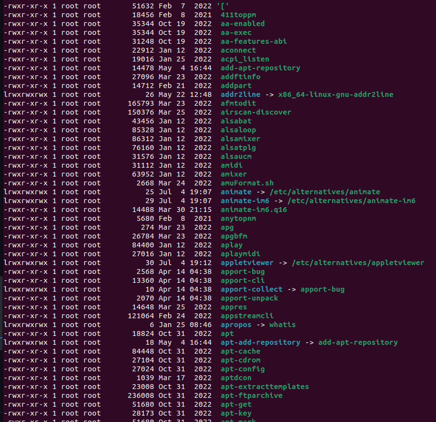

here:

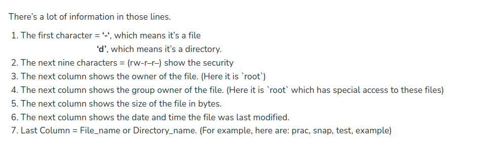

'-' => filetype. (It can be directory/ link file).
rw- => User (next 3 bits).
'---' => groups (next 3 bits).
'---' => Others (next 3 bits).
Here, r->read, w->write and x->execute permission. 

--> To check the permissions of directories: 
 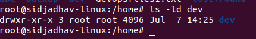

### Security permissions in linux: 

First, you must think of those nine characters as three sets of three characters (see the box at the bottom). Each of the three “rwx” characters refers to a different operation you can perform on the file.  

---     ---     ---
rwx     rwx     rwx
user    group   other 

### Reading the security permissions
For example:  “rw-  r-x  r–“
“rw-“: the first three characters `rw-`. This means that the owner of the file can “read” it (look at its contents) and “write” it (modify its contents). we cannot execute it because it is not a program but a text file. 
“r-x”: the second set of three characters “r-x”. This means that the members of the group can only read and execute the files. 
“r–“: The final three characters “r–” show the permissions allowed to other users who have a UserID on this Linux system. This means anyone in our Linux world can read but cannot modify or execute the files’ contents.  

### Changing security permissions

The command you use to change the security permissions on files is called “chmod“, which stands for “change mode” because the nine security characters are collectively called the security “mode” of the file. 

#### For other (o) group: 
--> Using chmod o+x [ file_name ] => This adds execute permission to the file.
--> chmod o-x [ file_name ] deletes execute permission for the file.

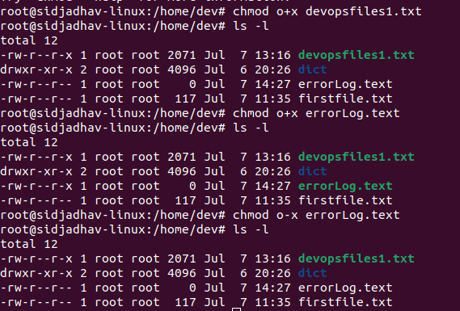

#### For group permissions :
-->  Using chmod g+x [ file_name ] => This adds escecute permissions to file for groups.
--> chmod g-x [ file_name ] deletes execute permission for the file for groups.

#### For User permissions: 

-->  Using chmod u+x [ file_name ] => This adds escecute permissions to file for groups.
--> chmod u-x [ file_name ] deletes execute permission for the file for groups.

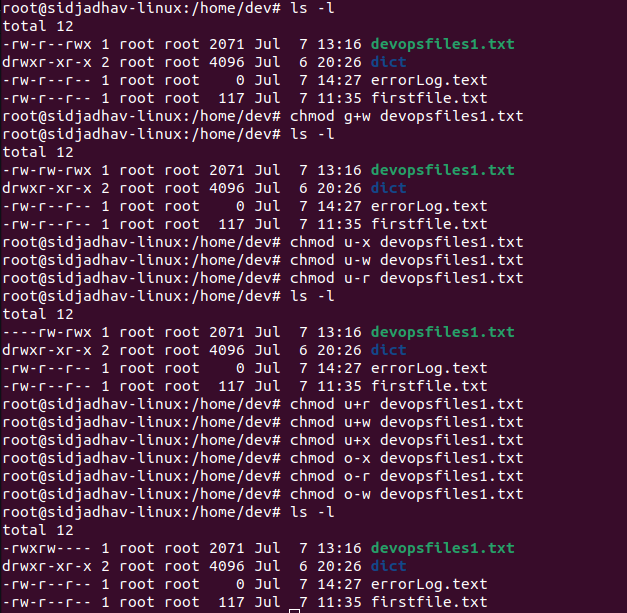

### The Octal notations: 
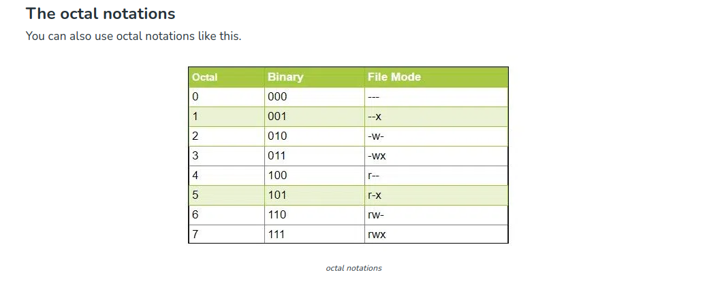

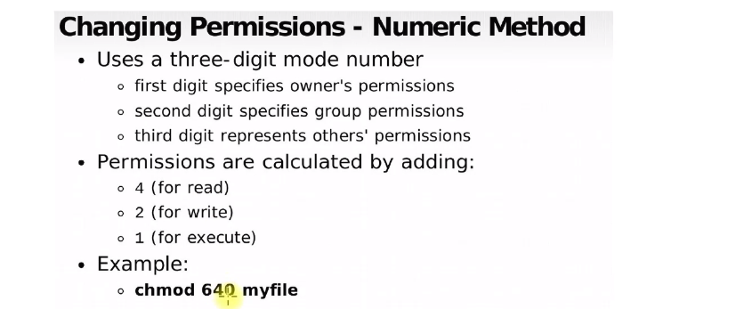

Eg: If we give full permission to user, group and no permission to others.
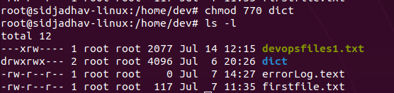

## Sudo: 

sudo (Super User DO) command in Linux is generally used as a prefix for some commands that only superusers are allowed to run. If you prefix any command with “sudo”, it will run that command with elevated privileges or in other words allow a user with proper permissions to execute a command as another user, such as the superuser. This is the equivalent of the “run as administrator” option in Windows. The option of sudo lets us have multiple administrators. 
Sudo gives root user authorities to normal users.

The syntax for 'sudo' command: 
sudo -V | -h | -l | -v | -k | -K | -s | [ -H ] [-P ] [-S ] [ -b ] | 
[ -p prompt ] [ -c class|- ] [ -a auth_type ] [-r role ] [-t type ] 
[ -u username|#uid ] command

-- sudo -i : This switches to root user.
-- su - user1 : This switches to other user. 

--> Usages of Suod: 
There are many Linux commands that require sudo privileges to run but one must remember to use it with caution as they can modify critical system configurations and files. To avoid consequences, we should check twice before running commands. Commands like:

Installing a new package: `sudo apt-get install package_name`
Updating the system: `sudo apt-get update && sudo apt-get upgrade`
Modifying system configurations: `sudo nano /etc/fstab`
Starting a system service: `sudo systemctl start service_name`
Stopping a system service: `sudo systemctl stop service_name`
Creating a new user account: `sudo useradd username`
Changing file permissions: `sudo chmod 755 file_name`

Read more here: https://www.geeksforgeeks.org/sudo-command-in-linux-with-examples/

## Packages: 

### RPM Packages: (Red Hat Package Manager)

Red Hat Package Manager or RPM is a free and open-source package management system for Linux. The RPM files use the .rpm file format.  RPM package manager was created to use with Red Hat Linux, but now it is supported by multiple Linux distributions such as Fedora, OpenSUSE, Ubuntu, etc.

RPM packages can be cryptographically verified with GFG and MD5. They support automatic build-time dependency evaluation.

#### TREE Package: 
This gives us the directories and files in tree structure. In Linux, a tree is defined as a recursive directory listing program which generates a depth-indented file's list. Without any parameters, the tree lists the files in the present directory. At the time directory parameters are given, the tree alternately lists each file per directory found in the given directories. When the list of each directory and file is complete, then the tree will return the total number of directories and files listed. Various options are available in order to modify the character which is used in the output and to use color.

eg: 
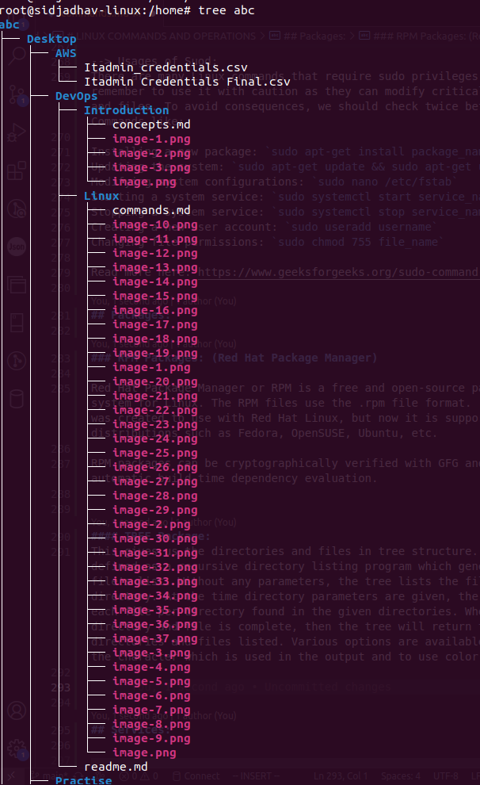

## Services: 

#### HTTPD (Hyper-text-transfer-protocol deamon)
Apache HTTPD is an HTTP server daemon produced by the Apache Foundation. It is a piece of software that listens for network requests (which are expressed using the Hypertext Transfer Protocol) and responds to them.

Note: 
httpd and Apache 2 HTTP Server: 
They are the same application - just that some Linux distributions refer to it differently within package managers and config files. RedHat-based distros (CentOS, Fedora) refer to it as httpd while Debian-based distros (Ubuntu) refer to it as apache

#### Apache 2 HTTP Server services (httpd in RPM based ubuntu): 

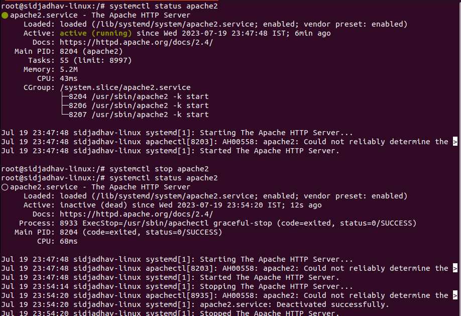
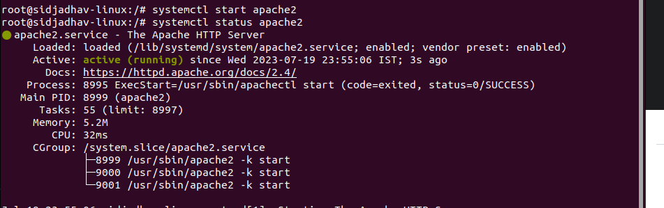
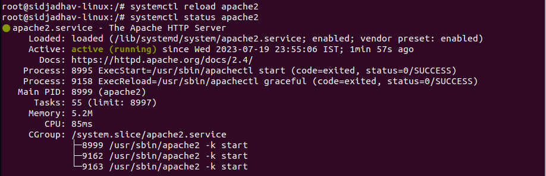

Is-active and Is-enabled for a service: 
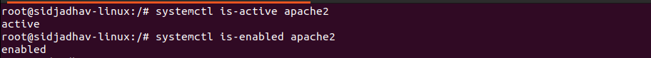

Config file for apache 2: 
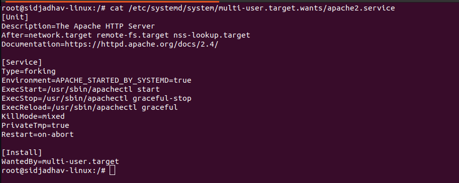

## Processes: 

### top command: 
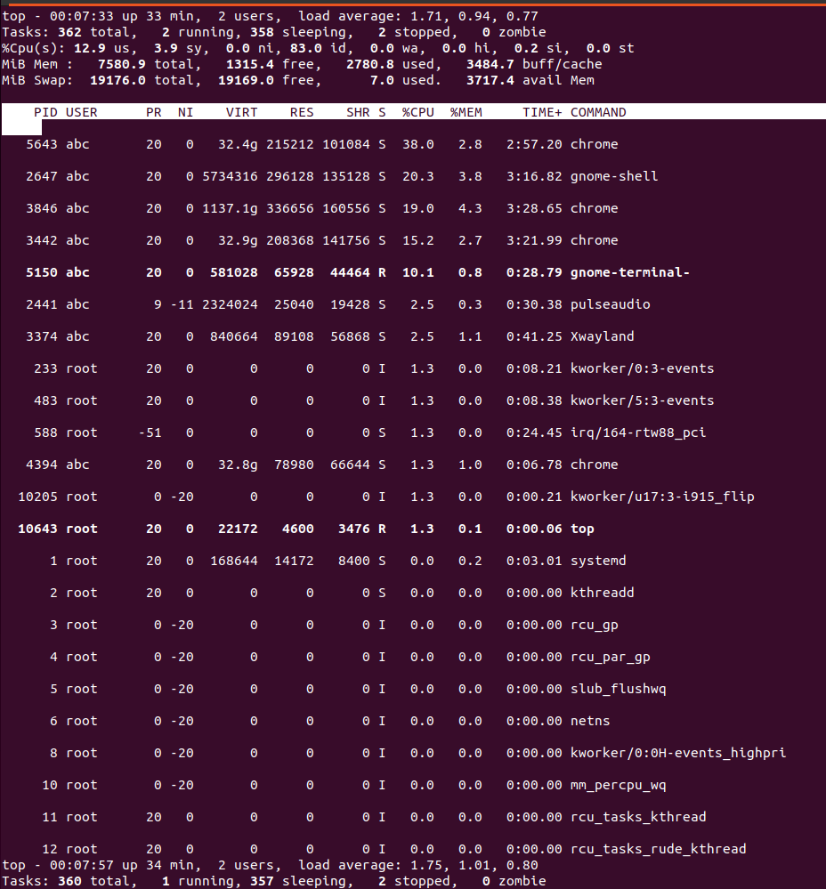

### ps aux: 
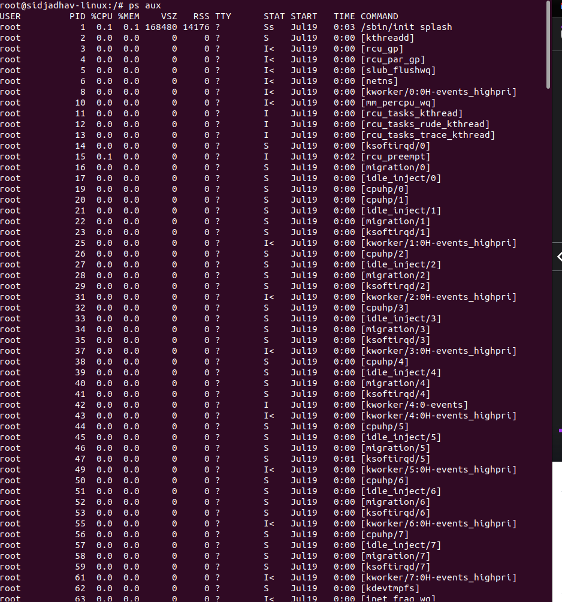

### ps -ef : 
It is same as ps aux but also displays PPID (Parent Process ID). 
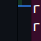

### kill, force kill and orphan processes: 
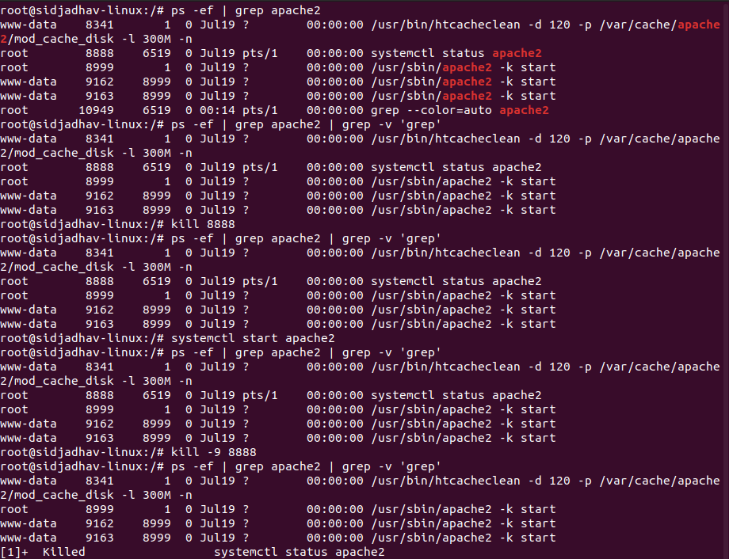

## Archiving: 
When we need to store/take backup of files and directories, archiving is done. 

### tar command: 
The Linux ‘tar’ stands for tape archive, is used to create Archive and extract the Archive files. tar command in Linux is one of the important command which provides archiving functionality in Linux. 

Syntax: 

tar [options] [archive-file] [file or directory to be archived]

Options: 
-c : Creates Archive 
-x : Extract the archive 
-f : creates archive with given filename 
-t : displays or lists files in archived file 
-u : archives and adds to an existing archive file 
-v : Displays Verbose Information 
-A : Concatenates the archive files 
-z : zip, tells tar command that creates tar file using gzip 
-j : filter archive tar file using tbzip 
-W : Verify a archive file 
-r : update or add file or directory in already existed .tar file 

eg: 
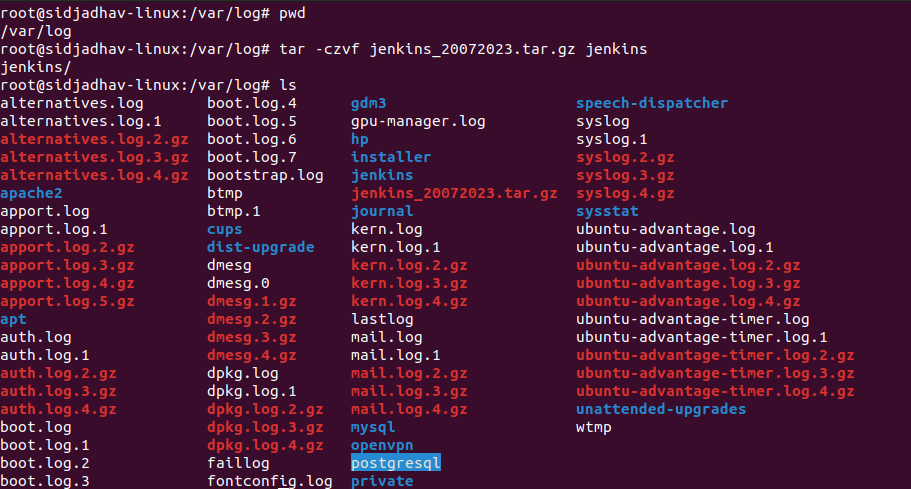