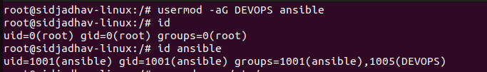

# LINUX COMMANDS AND OPERATIONS
 
1. Basics CLI Commands.
2. Understanding files in Linux.
3. Filters and Redirection
4. Users and Group.
5. Sudo 
6. Software management.
7. Services and Processes.
8. Advanced commands.
9. Server Managements.

## Linux Directories

The file Structure of linux with the extensions is:

## Commands and File Systems

1. The following commands checks for the current directory, os release etc.

2. sudo -i command will switch us to root directory.

3. This is top level directory for UNIX OS

Note: /bin is absolute path.

4. Linux Command Syntax
    -- [command] [options] [arguments]
    eg: cp -r filetobecopied destinationPath

    Note: [command] --help to get to more about an command.

5. Most Used Linux commands to be used: https://www.javatpoint.com linux-commandsJavaPoint

6. Note: Be very careful while using [rm -rf *] command, as it deletes all present directories in the current workig directories and it do not have any backup.

## VIM EDITOR

Vim is a Unix text editor that's included in Linux, BSD, and macOS. It's known for being fast and efficient, in part because it's a small application that can run in a terminal (although it also has a graphical interface), but mostly because it can be controlled entirely with the keyboard with no need for menus or a mouse.

VIM has 3 modes:
    -- Command Mode.
    -- Insert Mode. (edit mode).
    -- extended command Mode.

## Types of Files in Linux 

In Linux, everything is considered as a file. In UNIX, seven standard file types are regular, directory, symbolic link, FIFO special, block special, character special, and socket. In Linux/UNIX, we have to deal with different file types to manage them efficiently.

In Linux/UNIX, Files are mainly categorized into 3 parts:
    -- Regular Files
    -- Directory Files
    -- Special Files

    Note: ls -l command gives long listing of existing files in current dict.

-- Making entire Directorty Structure : [mkdir -p [directory absolute path]].

### Soft Link in file systems

If we change the path of file, the link becomes dead.

To remove the link:

## Filter & I/O redirections commands

### grep command: 

The grep filter searches a file for a particular pattern of characters, and displays all lines that contain that pattern. The pattern that is searched in the file is referred to as the regular expression (grep stands for global search for regular expression and print out). 

Syntax: 

grep [options] pattern [files]

Note: 
-- [ var/log/ ] this path contains log files of system. So to trouble shoot the server errors, read the log files.
-- All the passwords of users and files/dict are stored in etc/psswd/ dirtrectory.

-- awk command is used to cut the coloms sepereated by : or other sepeators.
-- %s is used to replace characters with other ones.

### Redirection Commands (I/O):

#### Redirecting output to a file:  
-- [ > ]: This is used to redirect the output of a command. 
          eg: ls > sysinfo.txt will store the output of ls command inside the sysinfo file.
-- [ >> ]: This will appened to output to exisiting file and it will not override   the output from previous command. 

#### Redirecting output to "NULL: The output is dumped there but cannot be revieved. BLACK HOLE IN LINUX!!

### Piping : 

A pipe is a form of redirection (transfer of standard output to some other destination) that is used in Linux and other Unix-like operating systems to send the output of one command/program/process to another command/program/process for further processing. The Unix/Linux systems allow the stdout of a command to be connected to the stdin of another command. You can make it do so by using the pipe character ‘|’. 

We can write multiple commands in pipeline. Output of one command is given input to another in Pipelining.

Counting the number of files in /etc directories.

Searching files starting with host: 

Note: Searcing is done using locate/find command.

## Users and Groups

### Types of Users: 

Here x is link to shadow file which holds encrypted password.
-- 0:0 is user-id:group-id.
-- root:/ is current user. bin/bash is login shell.

Note: /etc contains information about the Users, Groups and passwords.

### Group Names in /etc/groups

### Create Users and Groups:

### Adding users into groups: 

### Assigning password for users:

### lsof command:
The lsof (list open files) command returns the user processes that are actively using a file system. It is sometimes helpful in determining why a file system remains in use and cannot be unmounted.

### Delete User: 

## File Permissions:

The ls command along with its -l (for long listing) option will show you metadata about your Linux files, including the permissions set on the file.

In this example, you see two different listings. The first field of the ls -l output is a group of metadata that includes the permissions on each file. Here are the components of the vimrc listing:

File type: -
Permission settings: rw-r--r--
Extended attributes: dot (.)
User owner: root
Group owner: root

Eg: 

here:

'-' => filetype. (FIrst Bit it filetype).
rw- => User (next 3 bits).
'---' => groups (next 3 bits).
'---' => Others (next 3 bits).
Here, r->read, w->write and x->execute permission. 
